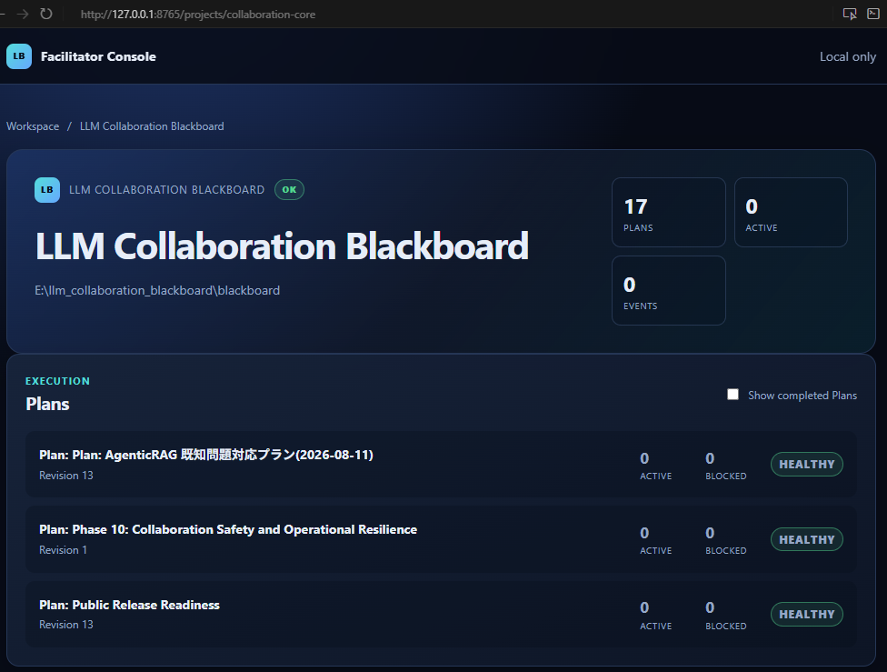
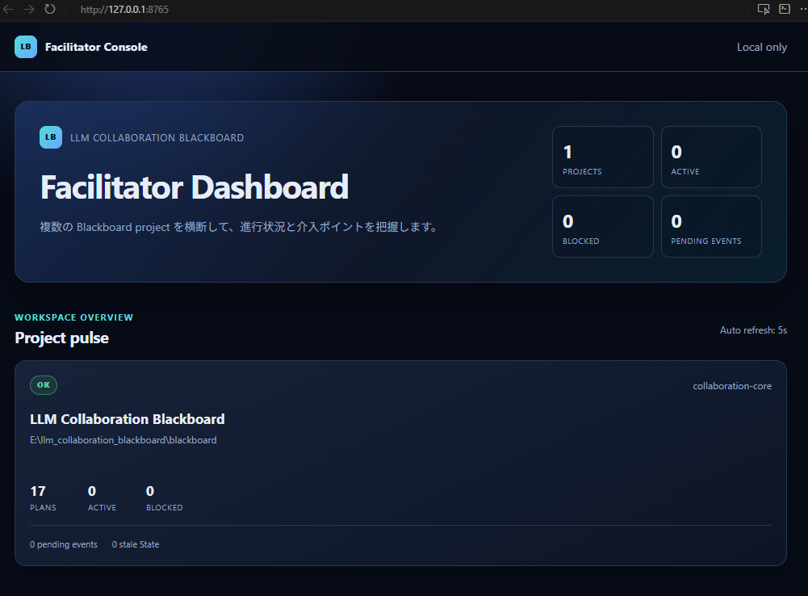

# LLM Collaboration Blackboard

[llm_collaboration_blackboard_spec_final_v1.0_ja.md](llm_collaboration_blackboard_spec_final_v1.0_ja.md) v1 の実装。

LLM Collaboration Blackboard は、複数の LLM と人間が同じ作業対象を共有するための、Markdown を主資料とした協調基盤です。Plan、タスク、イベント、メモリ、状態を一つの Blackboard に集約し、MCP サーバーやローカルダッシュボードから操作できます。

このプロジェクトの狙いは、チャットログのように散らばった情報ではなく、検証可能な Plan とイベントとして作業の流れを残すことです。これにより、誰が何を担当し、どのタスクが進行中で、どの変更が行われたかを追跡しやすくなります。



## 何ができるか

- Markdown と YAML Front Matter を中心にした Plan 管理
- タスクの claim / update / cancel / recover を通じた状態遷移管理
- 変更ごとの監査イベントの記録と再送
- Role に応じた操作制限（Role は自己申告ベース）
- ローカルダッシュボードによる Plan と進捗の可視化

## 典型的な使い方

1. まず Plan を作成し、タスクを追加します。
2. Researcher / Implementer / Reviewer の役割を割り当てます。
3. 必要なタスクを claim して作業を開始します。
4. 状態を update し、必要に応じて blocked / recover で再開・停止を切り替えます。
5. Event と Plan を通じて、作業履歴や判断の背景を追えるようにします。

このような流れは、複数の LLM を並行して動かす実験、共同開発、レビュー付きの実装フローに向いています。

## クイックスタート

### 1. 前提条件

- Python 3.10 以上（3.13 推奨）
- Windows / macOS / Linux で利用可能

### 2. インストール

```powershell
py -3.13 -m venv .venv
.\.venv\Scripts\python.exe -m pip install -e .[dev]
```

### 3. Blackboard ルートを用意する

```powershell
$env:BLACKBOARD_ROOT = "C:\path\to\blackboard"
```

### 4. サーバーを起動する

```powershell
.\.venv\Scripts\blackboard-server
```

### 5. ダッシュボードを起動する（任意）

```powershell
.\.venv\Scripts\blackboard-dashboard --config .\dashboard.yaml
```

ブラウザで http://127.0.0.1:8765/ を開くと、Plan とタスクの状態を確認できます。



## MCP で使う

このリポジトリでは、MCP 経由で Blackboard を操作できます。まずリポジトリルートの [.mcp.json.example](.mcp.json.example) を .mcp.json にコピーし、絶対パスに置き換えてください。

```json
{
  "mcpServers": {
    "blackboard": {
      "command": "<ABSOLUTE_PATH_TO_THIS_REPO>/.venv/Scripts/python.exe",
      "args": ["-m", "blackboard.server"],
      "env": {
        "BLACKBOARD_ROOT": "<ABSOLUTE_PATH_TO_THIS_REPO>/demo_blackboard"
      }
    }
  }
}
```

代表的なツールには次のようなものがあります。

- read_plan: Plan の内容と実行可能タスクを取得
- claim_task: タスクを claim して作業を開始
- update_task: タスク状態を done / blocked / cancelled に更新
- add_task / edit_task / cancel_task: Plan を更新
- recover_task: blocked タスクを pending に戻す
- read_memory / write_memory: メモリ文書を扱う
- read_state / write_state: 状態文書を扱う

## プロジェクト構成

- [src/blackboard](src/blackboard): サーバー実装、モデル、権限制御、ダッシュボード実装
- [scripts](scripts): デモや補助スクリプト
- [blackboard](blackboard): 例示・実行時に使う Blackboard データ
- [dashboard.yaml](dashboard.yaml): ローカルダッシュボード設定サンプル

## 開発

開発ルールやコミット方針は [CONTRIBUTING.md](CONTRIBUTING.md) を参照してください。

```powershell
.\.venv\Scripts\python.exe -m pytest
.\.venv\Scripts\python.exe -m ruff check src tests scripts
```

## ライセンス

このプロジェクトは MIT License のもとで公開されています。詳細は [LICENSE](LICENSE) を参照してください。
